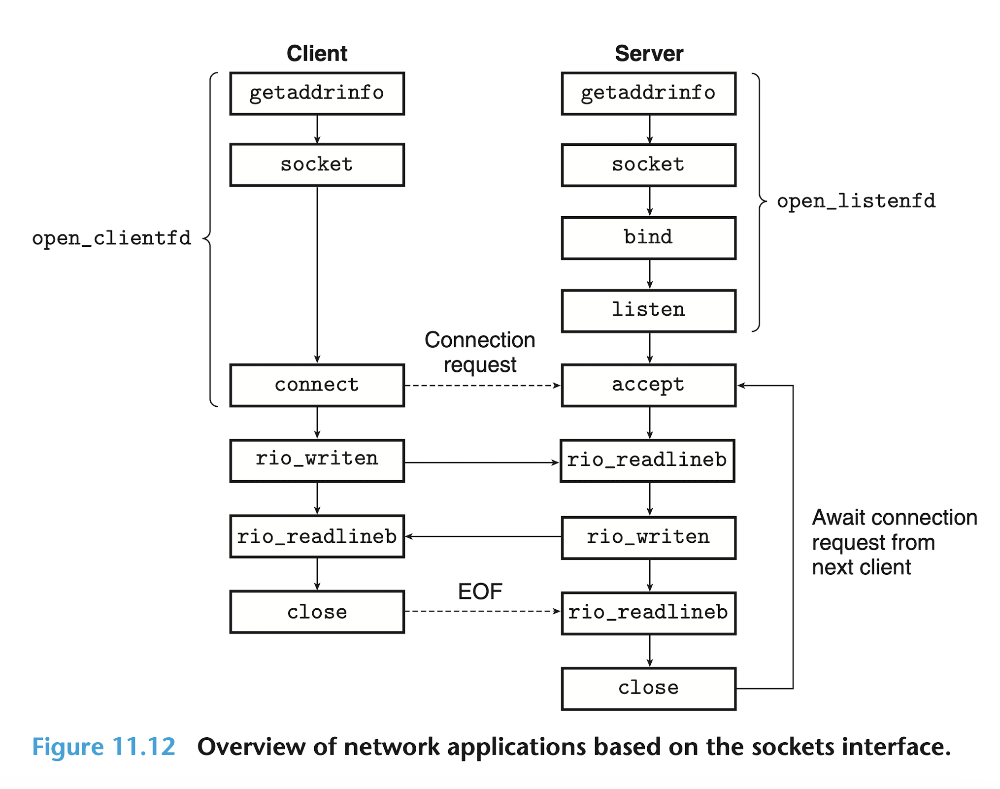
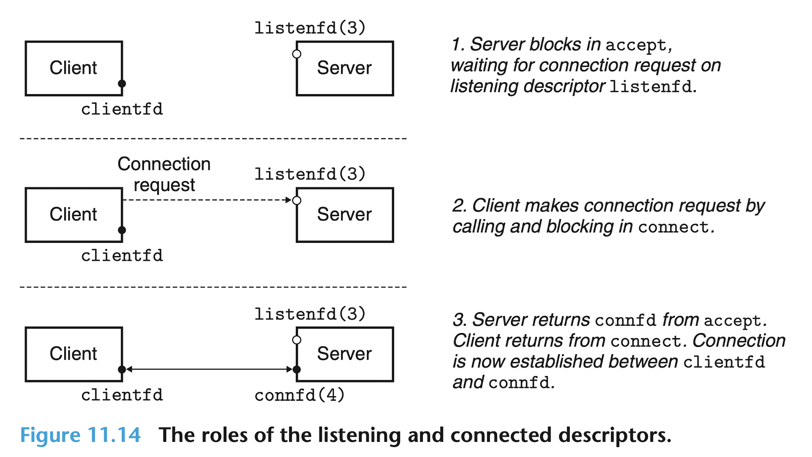
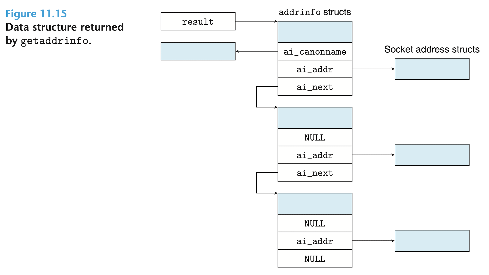

### 11.4 소켓 인터페이스

소켓 인터페이스 sockets interface는 네트워크 어플리케이션을 만들 때 UNIX I/O 함수들과 함께 사용되는 함수들의 집합이다. 소켓 인터페이스는 Unix 계열, Windows, Macintosh 시스템을 포함하여 대부분의 현대 시스템에 구현되어 있다. 사진 11.12는 전형적인 클라이언트-서버 트랜잭션의 맥락에서의 소켓 인터페이스의 모습을 개략적으로 보여준다. 개별적인 함수들을 논할 때 이 사진을 로드맵으로 사용하면 된다.  



> 소켓 인터페이스의 기원  
최초의 소켓 인터페이스는 1980년대 초에 캘리포니아 버클리 대학의 연구자에 의해 개발되엇다. 이런 이유로 소켓 인터페이스는 종종 Berkeley sockets이라고 불리기도 한다. 버클리 연구자들은 어떤 하부 프로토콜에서도 작업할 수 있도록 하기 위해 소켓 인터페이스를 개발했다. 첫 번째 구현물은 TCP/IP였다. 연구자들은 TCP/IP를 Unix 4.2BSD 커널에 넣었고 다양한 대학과 연구실로 TCP/IP를 퍼뜨렸다. 이는 인터넷 역사에서 중요한 이벤트이다. 거의 하룻밤만에 수천 명의 사람이 TCP/IP와 그것의 소스 코드에 접근했다. 이는 엄청난 흥분을 불러일으켰고 네트워킹과 인터네트워킹 분야의 새로운 연구가 휘몰아치도록 만들었다. 

> 접미사 _in은 무엇을 의미하는가?  
접미사 _in은 input이 아니라 internet의 축약어이다.

### 11.4.1 소켓 주소 구조 Socket Address Structures

리눅스 커널의 관점에서, 소켓은 소통의 끝 점 end point이다. 리눅스 프로그램의 관점에서, 소켓은 대응되는 descriptor를 가진 open file이다.  
인터넷 소켓 주소는 그림 11.13에 있는 것과 같이 sockaddr_in 타입의 16 바이트 구조체에 저장되어 있다. 인터넷 어플리케이션에 대해서 sin_family 필드는 AF_INET이고, sin_port 필드는 16 비트 포트 번호이고, sin_addr 필드는 네트워크 바이트 순서 (big-endian)이다.   
connect, bind, accept 함수는 특정 프로토콜에 대한 소켓 주소 구조체를 가리키는 포인터를 요구한다. 소켓 인터페이스의 설계자가 마주한 문제는 모든 종류의 소켓 주소 구조체를 받아들이기 위해서 어떻게 함수를 정의해야 할지였다. 오늘날, 우리는 generic void * 포인터를 사용하지만 그 당시에는 C에 generic void * 포인터가 없었다. 그들의 해답은 소켓 함수가 generic sockaddr 구조를 기대하도록 정의하고, 애플리케이션이 프로토콜 특화 구조를 가리키는 모든 포인터를 이 generic 구조체인 sockaddr를 가리키도록 캐스팅하도록 요구하는 것이다. 우리의 코드 예시를 간단하게 하기 위해서, 우리는 스티븐의 설명을 따라 다음과 같은 타입을 정의하였다.
(역주: `sockaddr_in`은 IPv4 주소 정보를 다룰 때 주로 사용되는 구조체입니다. 반면에 `sockaddr`은 다양한 주소 체계를 포괄적으로 다룰 수 있도록 설계된 범용 구조체입니다. 그러나 실제로 IPv4 기반의 소켓 통신을 할 때는 `sockaddr_in`을 사용하여 더 간편하고 명확하게 주소 정보를 다룰 수 있습니다.)

```C
typedef struct sockaddr SA;
```

우리는 sockaddr_in 구조체를 generic sockaddr 구조체로 캐스팅해야 할 때마다 이 타입을 사용할 것이다.   
(역주: 소켓 함수들은 기본적으로 `struct sockaddr` 형식의 포인터를 사용하기 때문에, `sockaddr_in`의 크기가 `sockaddr` 구조체와 동일해야 하는데, `sockaddr` 구조체의 크기가 더 클 수 있습니다. 이를 맞추기 위해 `sin_zero`라는 8바이트의 배열을 사용해 `sockaddr_in` 구조체의 크기를 맞추고, 구조체 사이즈의 일관성을 유지합니다.)

```C
/* IP socket address structure */
struct sockaddr_in {
    uint16_t        sin_family;     /* Protocol family (always AF_INET) */
    uint16_t        sin_port;       /* Port number in network byte order */
    struct in_addr  sin_addr;       /* IP address in network byte order */
    unsigned char   sin_zero[8];    /* Pad to sizeof(struct sockaddr) */
};

/* Generic socket address structure (for connect, bind, and accept) */
struct sockaddr {
    uint16_t        sa_family;      /* Protocol family */
    char            sa_data[14];     /* Address data */
};
```

### 11.4.2 socket 함수

클라이언트와 서버는 socket descriptor를 만들기 위해서 socket 함수를 사용한다.

```C
#include <sys/types.h>
#include <sys/socket.h>

int socket(int domain, int type, int protocol);

// Returns: nonnegative descriptor if OK, -1 on error
```

만약 소켓이 커넥션의 끝 점 end point에 있길 바란다면, 우리는 다음과 같은 하드코딩된 인자로 socket 함수를 호출하면 된다. (역주: clientfd는 client file descriptor의 줄임말이다.)

```C
clientfd = Socket(AF_INET, SOCK_STREAM, 0);
```

여기서 AF_INET은 우리가 32 비트 IP 주소를 사용한다는 것을 나타내고, SOCK_STREAM은 소켓이 커넥션의 끝 점 end point가 될 것임을 나타낸다. 하지만, 가장 최고의 케이스는 이러한 파라미터들을 자동적으로 생성해주는 `getaddrinfo` 함수를 사용하는 것이다. 이렇게 하면 코드가 protocol에 독립적인 코드가 된다. 우리는 getaddrinfo를 socket 함수와 함께 어떻게 쓸 수 있는지를 11.4.8에서 보여줄 것이다. (역주: `SOCK_STREAM`은 소켓을 생성할 때 사용하는 소켓 유형 중 하나로, TCP 기반의 연결 지향적 통신을 지원하는 소켓을 의미합니다. 이 소켓 유형은 데이터 스트림의 연속적인 전달을 보장하며, 데이터 전송 순서와 무결성을 유지합니다.)

socket 함수에 의해 반환되는 clientfd descriptor는 부분적으로만 오픈되어 있고 읽거나 작성될 수 없다. 소켓의 opening을 끝내는 방법은 클라이언트인지 서버인지에 따라 다르다. 다음 절에서는 클라이언트인 경우에 소켓의 오픈을 어떻게 종료하는지에 대해 설명하겠다.

### 11.4.3 connect 함수

클라이언트는 connect 함수를 호출하여 서버와 커넥션을 수립한다.

```C
#include <sys/socket.h>

int connect(int clientfd, const struct sockaddr *addr, socklen_t addrlen);

// Returns 0 if OK, -1 on error
```

connect 함수는 소켓 주소 addr에 있는 서버와의 연결을 수립하기 위해 시도한다. addrlen은 sizeof(sockaddr_in)이다. connect 함수는 커넥션이 성공적으로 수립되거나 에러가 발생할 때까지 블로킹된다. 만약 연결이 성공적이라면, clientfd descriptor는 읽기와 쓰기를 위한 준비가 완료된 것이고, 연결은 다음과 같은 socket 쌍으로 규정된다.

(x:y, addr.sin_Addr:Addr.sin_port)

x는 클라이언트의 IP 주소이고, y는 일시적인 포트이다. 이 포트는 클라이언트 호스트에 있는 클라이언트 프로세스를 식별한다. socket과 마찬가지로 가장 좋은 방법은 getaddrinfo를 이용하여 connect 함수에게 인자를 전달하는 것이다.

### 11.4.4 bind 함수

남아 있는 소켓 함수인 bind, listen, accept는 서버가 클라이언트와 커넥션을 수립할 때 사용된다.

```C
#include <sys/socket.h>

int bind(int sockfd, const struct sockaddr *addr, socklen_t addrlen);

// Returns: 0 if Ok, -1 on error
```

bind 함수는 커널에게 addr에 있는 서버의 소켓 주소를 소켓 descriptor인 sockfd와 연결해달라고 요청한다. addrlen 인자는 sizeof(sockaddr_in)이다. socket과 connect와 마찬가지로 가장 좋은 방법은 getaddrinfo를 사용하여 bind 함수에게 인자를 제공하는 것이다.

### 11.3.4 listen 함수

클라이언트는 커넥션 요청을 개시하는 active한 개체이다. 서버는 클라이언트로부터 연결 요청을 기다리는 passive한 개체이다. 기본적으로, 커널은 socket 함수에 의해 생성된 descriptor가 커넥션의 클라이언트 쪽 끝에 존재하는 active 소켓에 대응한다고 가정한다. 서버는 listen 함수를 호출하여 descriptor가 클라이언트 대신 서버가 사용할 것이라고 커널에게 알려준다. 

```C
#include <sys/socket.h>

int listen(int sockfd, int backlog);

// Returns: 0 if OK;
```

listen 함수는 sockfd를 active 소켓에서 listening 소켓으로 변환시킨다. sockfd는 그러면 이제 클라이언트로부터 연결 요청을 수락할 수 있다. backlog 인자는 커널이 요청을 거절하기 전에 줄 세워야 하는 outstanding한 연결 요청의 수에 대한 정보를 제공한다. backlog의 정확한 의미는 TCP/IP의 이해를 요구하는데 이는 우리의 범위를 넘어선다. 우리는 일반적으로 1,024와 같은 큰 값을 설정한다. 




### 11.4.6 accept 함수

서버는 accept 함수를 호출함으로써 클라이언트로부터 connection 요청을 기다린다.

```C
#include <sys/socket.h>

int accept(int listenfd, struct sockaddr *addr, int *addrlen);

// Returns: nonnegative connected descriptor if OK, -1 on error
```

accept 함수는 클라이언트로부터 연결 요청이 listenfd라는 리스닝 디스크립터에 도착할 때까지 기다린 후,
addr에 클라이언트의 소켓 주소를 채워넣고, Unix I/O 함수를 이용하여 클라이언트와 소통하는 데 사용될 수 있는 connected descriptor를 반환한다.  

listening descriptor와 connected descriptor 사이의 차이점은 학생들을 헷갈리게 할 수 있다. listening descriptor는 클라이언트 연결 요청에 대해서 끝 점 end point로서 역할한다. listening descriptor는 한 번 생성되고나서 서버의 살아 있는 동안 계속 존재한다. connected descriptor는 클라이언트와 서버 사이에 수립된 커넥션의 끝 점 end point이다. connected descriptor는 서버가 연결 요청을 받을 때마다 생성되고 클라이언트에게 서비스하는 동안에만 존재한다.

사진 11.4는 listening descriptor와 connected descriptor의 역할을 간략하게 보여준다. 단계 1에서 서버는 accept 함수를 호출한다. accept 함수는 listening descriptor에 연결 요청이 도착하기를 기다린다. 이 descriptor를 descriptor 3이라고 부르겠다. descriptor 0-2는 표준 파일을 위해 배정되어 있다.  
단계 2에서 클라이언트는 connect 함수를 호출한다. connect 함수는 listenfd에게 연결 요청을 보낸다. 단계 3에서 accept 함수는 새로운 connected descriptor인 connfd를 열고 (이 descriptor를 descriptor 4라고 부른다.) clientfd와 connfd 사이의 연결을 수립하고, 응용 프로그램에게 connfd를 반환한다. 클라이언트는 또한 connect 함수에서 돌아온다. 이 지점부터, 클라이언트와 서버는 각각 clientfd와 connfd를 읽고 작성함으로써 데이터를 주고받을 수 있게 된다. 

> 왜 listening descriptor와 connected descriptor 사이에 구분을 두나요?  
소켓 인터페이스가 listening과 connected descriptor 사이에 구분을 두는 이유는 무엇일까? 겉으로 보기에는 불필요한 복잡함 같아보이기도 한다. 하지만 이 둘을 구별하는 일은 꽤 유용하다. 왜냐하면 이는 많은 클라이언트 연결을 처리할 수 있는 동시성 서버 concurrent server를 만들 수 있게 해주기 때문이다. 예를 들어, 연결 요청이 listening descriptor에 도착할 때마다 우리는 connected descriptor를 통해 클라이언트와 통신하는 새로운 프로세스를 fork할 수 있다. 당신은 Chapter 12에서 동시성 서버에 대해 더 배우게 될 것이다. 

### 11.4.7 호스트와 서비스 변환

리눅스는 이진 형태의 소켓 주소 구조체와 문자열 형태의 호스트 이름, 호스트 주소, 서비스 이름, 포트 번호 사이의 변환을 위해 getaddrinfo와 getnameinfo라고 불리는 강력한 함수들을 제공한다. 소켓 인터페이스와 함께 사용될 때, 이 함수들은 IP 프로토콜 버전에 독립적인 네트워크 프로그램을 작성할 수 있게 해준다. 

#### getaddrinfo 함수

getaddrinfo 함수는 문자열 형태의 호스트 네임, 호스트 주소, 서비스 이름, 포트 번호를 소켓 주소 구조체로 변환해준다. getaddrinfo는 옛날에 사용됐던 gethostbyname과 getservbyname 함수를 대체하는 현대의 함수이다. gethostbyname과 getservbyname 함수와 달리, getaddrinfo는 재진입이 가능하고 모든 프로토콜과 작업할 수 있다. (역주: getaddrinfo 함수가 재진입 가능(reentrant)하다는 것은, 동시에 여러 스레드에서 안전하게 호출될 수 있다는 뜻입니다. 즉, 여러 스레드에서 getaddrinfo 함수를 호출해도 서로의 결과에 영향을 주지 않고, 충돌 없이 독립적으로 동작합니다.   
재진입 가능 함수는 다음과 같은 특징을 가집니다:

1. 전역 또는 정적 변수를 사용하지 않음: 함수가 내부적으로 전역 변수나 정적 변수를 사용하지 않기 때문에, 여러 스레드에서 동일한 함수를 호출해도 변수 충돌이 발생하지 않습니다.

2. 스레드 안전(thread-safe): 각 스레드가 독립된 메모리 공간을 사용하므로, 스레드 간의 상호작용이 없으며 데이터 손상 없이 병렬 처리가 가능합니다.)  


```C
#include <sys/types.h>
#include <sys/socket.h>
#include <netdb.h>

int getaddrinfo(const char *host, const char *service, const struct addrinfo *hints, struct addrinfo **result);

// Returns: 0 if Ok, nonzero error code on error

void freeaddrinfo(struct addrinfo *result);

// Returns: nothing

const char *gai_strerror(int errcode); // getaddrinfo_strerror

// Returns: error message
```

호스트 host와 서비스 service(소켓 주소의 두 가지 구성 요소)가 주어졌을 때, `getaddrinfo`는 `addrinfo` 구조체의 연결 리스트를 가리키는 `result`를 반환한다. 이 `addrinfo` 구조체의 연결 리스트에 있는 `addrinfo`들은 각각 호스트와 서비스에 대응되는 주소 구조체를 가리킨다. 
클라이언트가 `getaddrinfo`를 호출하고 나서, 클라이언트는 이 리스트를 방문하여, `socket` 함수와 `connect` 함수에 대한 호출이 성공하고 연결이 수립될 때까지 `addrinfo`의 소켓 주소로 연결을 시도한다.

비슷하게, 서버도 `socket` 함수와 `bind` 함수에 대한 호출이 성공할 때까지 리스트에 있는 모든 소켓 주소를 시도하고 <u>descriptor는 유효한 소켓 주소에 바인딩된다</u>. 
메모리 누수를 피하기 위해서, 응용 프로그램은 반드시 마지막에 `freeaddrinfo` 함수를 호출함으로써 리스트를 free해주어야 한다. 만약 `getaddrinfo` 함수가 nonzero error code를 반환한다면, 응용 프로그램은 코드를 메시지 문자열로 변환해주기 위해서 `gai_strerror` 함수를 호출할 수 있다. (역주: "Non-zero error code"란 프로그래밍에서 오류나 예외 상황을 나타내기 위해 반환되는 값 중, 0이 아닌 값을 의미합니다. 일반적으로, 많은 함수나 프로그램은 0을 성공적인 실행을 의미하는 값으로 사용하고, 0이 아닌 값(즉, non-zero)이 반환되면 오류나 문제 상황을 나타냅니다.)

`getaddrinfo` 함수의 인자 중 
- `host` 인자
    - 도메인 이름일 수도 있고 
    - 숫자 주소일 수 있다.(예시: dotted-decimal IP 주소) 
- `service` 인자
    - 서비스 이름(예시: http)일 수도 있고
    - 10진수 포트 번호일 수 있다.   

우리가 호스트 네임을 주소로 변환하는 데 관심이 없다면, 우리는 호스트에 NULL을 설정할 수 있다. service에 대해서도 마찬가지이다. 하지만, 적어도 그들 중 하나는 기술되어야 한다.

`hints` 인자는 선택적인 것으로, 자료형은 `addrinfo` 구조체이다. `hints`를 통해`getaddrinfo` 함수가 반환하는 소켓 주소의 목록을 정교하게 조작할 수 있다. `getaddrinfo` 함수에 `addrinfo`가 `hints` 인자로 전달 될 때 이 구조체에는 오직 
- `ai_family`, 
- `ai_socktype`, 
- `ai_protocol`, 
- `ai_flags`  
필드만이 설정될 수 있다. 다른 필드들은 0 (또는 NULL)로 설정되어야 한다. 실제로는, `memset` 함수를 이용하여 전체 구조체를 0으로 설정하고 일부 선택된 필드만 설정한다.

- 기본적으로, `getaddrinfo` 함수는 IPv4와 IPv6 소켓 주소를 모두 반환할 수 있다. `ai_family`를 `AF_INET`으로 설정하면 반환되는 리스트를 IPv4 주소로 제한하게 된다. `AF_INET6`으로 설정하면 반환하는 리스트를 IPv6 주소로 제한하게 된다.

(역주: `addrinfo` 구조체는 `getaddrinfo()` 함수가 반환하는 주소 정보의 형식을 정의하는 구조체로, 소켓 프로그래밍에서 서버 주소와 포트 정보를 저장하고 소켓을 설정하는 데 사용됩니다. 이 구조체는 IP 주소와 관련된 정보를 다양한 형식으로 저장하고, 소켓을 만들거나 연결을 설정하는 데 필요한 정보를 제공합니다.)

```C
struct addrinfo {
    int              ai_flags;      /* Hints argument flags */
    int              ai_family;     /* First arg to socket function */
    int              ai_socktype;   /* Second arg to socket function */
    int              ai_protocol;   /* Third arg to socket function */
    char            *ai_canonname;  /* Canonical hostname */
    socklen_t        ai_addrlen;    /* Size of ai_addr struct */
    struct sockaddr *ai_addr;       /* Ptr to socket address structure */
    struct addrinfo *ai_next;       /* Ptr to next item in linked list */
};

```

- 기본적으로, 호스트와 연관된 각각의 고유 주소에 대해서, `getaddrinfo` 함수는 서로 다른 `ai_socktype` 필드(하나는 연결을 위해, 하나는 데이터그램(여기에서 다루지 않음), 하나는 raw sockets(여기에서 다루지 않음)을 위해)를 가진 최대 3가지 addrinfo 구조체를 반환할 수 있다. ai_socktype을 SOCK_STREAM으로 설정하면 리스트가 각각의 고유한 주소에 대해 최대 하나의 `addrinfo` 구조체를 가지도록 제한한다. `addrinfo`의 소켓 주소는 커넥션의 끝 점으로 사용될 수 있다. 이는 우리의 모든 예시 프로그램에서 바람직한 행동이 된다.
- ai_flags 필드는 기본 행동을 수정하는 비트 마스크이다. 이 비트 마스크는 다양한 값의 ORing 조합으로 생성할 수 있다. 여기 유용한 몇 가지를 소개한다.

    - `AI_ADDRCONFIG` 
    connection[34]?를 이용한다면 이 플래그를 추천한다. AI_ADDRCONFIG는 getaddrinfo에게 로컬 호스트가 IPv4로 설정된 경우에만 IPv4 주소를 반환하도록 요청한다.
    - `AI_CANONNAME`  
    기본적으로 ai_canonname 필드는 NULL이다. 만약 이 플래그가 설정되었다면, 이 플래그는 getaddrinfo에게 리스트에 있는 첫 번째 addrinfo 구조체의 ai_canonname 필드가 호스트의 표준 (공식) 이름을 가리키도록 지시한다.
    - `AI_NUMERICSERV`
    기본적으로 service 인자는 서비스 이름이거나 포트 번호일 수 있다. 이 플래그는 service 인자가 포트 번호가 되도록 강제한다.
    - `AI_PASSIVE`
    기본적으로 getaddrinfo는 connect를 호출할 때 클라이언트에 의해 active sockets으로 사용될 수 있는 소켓 주소를 반환한다. 이 플래그는 getaddrinfo 함수에게 서버가 사용할 수 listening sockets으로 사용할 수 있는 소켓 주소를 반환하라고 지시한다.이 경우에 host 인자는 NULL이어야 한다. 소켓 주소 구조체에 있는 주소 필드는 wildcard address일 것이다. wildcard address는 커널에게 이 서버가 이 서버에 들어오는 모든 IP 주소로의 요청을 수락할 것이라고 알려준다. 이는 우리의 모든 예시 서버에 대해 바람직하다.

(역주:
`addrinfo` 구조체의 `ai_flags` 필드는 주소 정보 검색 및 소켓 설정에 영향을 미치는 다양한 옵션 플래그를 지정하는 데 사용됩니다. 이를 통해 `getaddrinfo()` 함수의 동작을 제어할 수 있습니다.

주요 ai_flags 값들:  

1. `AI_PASSIVE`:

서버에서 사용되는 소켓을 생성할 때 사용됩니다.
이 플래그가 설정되면 반환된 IP 주소는 "0.0.0.0" 또는 "::" (IPv6의 경우)로 설정되어, 모든 인터페이스에 바인딩할 수 있도록 합니다.
클라이언트의 경우에는 이 플래그를 설정하지 않으며, 특정 IP 주소를 명시적으로 설정하여 서버에 연결합니다.
주로 `bind()` 호출 전에 사용됩니다.

2. `AI_CANONNAME`:

도메인의 정식 이름(official canonical name)을 반환하도록 요청합니다.
이 플래그를 설정하면 `getaddrinfo()`는 호스트의 정식 이름을 검색하고 이를 `addrinfo` 구조체의 `ai_canonname` 필드에 저장합니다.
사용 예시: DNS 조회를 통해 도메인의 정식 이름을 확인할 때.

3. `AI_NUMERICHOST`:

호스트 이름을 문자열로 해석하지 않고 숫자 IP 주소만 허용하도록 합니다.
즉, IP 주소가 도메인 이름이 아닌 숫자 형식이어야만 하며, 이를 통해 DNS 조회를 우회할 수 있습니다.
이 플래그가 설정되면 숫자 IP 주소를 직접 사용해야 하며, 도메인 이름을 사용하려고 하면 오류가 발생합니다.

4. `AI_NUMERICSERV`:

서비스 이름이 문자열이 아닌 숫자 포트 번호로만 해석되도록 합니다.
이 플래그가 설정되면, 서비스 포트를 명시할 때 문자열 포트 이름 대신 숫자 포트 번호를 사용해야 합니다. 예를 들어, "http" 대신 "80"을 사용해야 합니다.

5. `AI_V4MAPPED` (IPv6 전용):

ai_family가 AF_INET6로 설정된 경우, IPv6 주소가 없으면 IPv4 주소를 IPv4-mapped IPv6 주소로 반환하도록 요청합니다.
이 플래그를 사용하면 IPv4 주소를 IPv6 주소로 매핑하여 처리할 수 있습니다.
주로 IPv6 소켓을 사용하지만, IPv4 주소를 처리해야 할 때 유용합니다.

6. `AI_ALL` (IPv6 전용):

IPv6 주소뿐만 아니라 IPv4-mapped IPv6 주소도 반환하도록 요청합니다.
이 플래그는 AI_V4MAPPED와 함께 사용되어야 합니다.

7. `AI_ADDRCONFIG`:

이 플래그가 설정되면, 시스템에서 해당 IP 버전을 지원하는 경우에만 결과를 반환합니다.
예를 들어, 시스템이 IPv6 주소를 사용할 수 없으면 IPv6 주소를 반환하지 않습니다. IPv4 주소 역시 사용 가능한 경우에만 반환됩니다.
이를 통해 불필요한 주소 정보를 필터링할 수 있습니다.

8. `AI_DEFAULT`:

이 플래그는 기본적으로 AI_V4MAPPED | AI_ADDRCONFIG 플래그를 의미합니다. IPv6 소켓 사용 시 IPv4-mapped 주소를 허용하고, 시스템에서 지원되는 주소만 반환합니다.

)
    
`getaddrinfo` 함수가 결과 리스트에 addrinfo 구조체를 생성할 때, getaddrinfo는 ai_flags를 제외한 모든 필드를 채운다. ai_addr 필드는 소켓 주소를 가리키고, ai_addrlen 필드는 이 소켓 주소 구조체의 크기를 제공하고, ai_next 필드는 리스트에 있는 다음 addrinfo 구조체를 가리킨다. 다른 필드들은 소켓 주소의 다양한 속성들을 기술한다.  
getaddrinfo의 멋있는 측면 중 하나는 addrinfo 구조체에 있는 필드들이 불투명하다는 것이다. 이는 어플리케이션 코드에 의한 추가적인 조작 없이 getaddrinfo가 소켓 인터페이스에 있는 함수들에게 직접 전달될 수 있다는 점에서 그렇다. 예를 들어, ai_family, ai_socktype, ai_protocol은 소켓에 직접 전달될 수 있다. 비슷하게, ai_addr과 ai_addrlen은 connect와 bind 함수에게 직접적으로 전달될 수 있다. 이 강력한 속성은 특정 버전의 IP 프로토콜에 의존적이지 않은 클라이언트와 서버를 작성할 수 있게 해준다.

#### getnameinfo 함수

`getnameinfo` 함수는 `getaddrinfo`의 반대이다. `getnameinfo` 함수는 소켓 주소 구조체를 대응되는 호스트와 서비스 이름 문자열로 변환한다. 이 함수는 옛날에 사용되던 `gethostbyaddr` 함수와 `getservbyport` 함수의 현대판 대체 버전이다. 옛날 함수들과 달리 `getnameinfo` 함수는 프로토콜에 독립적이다.

```C
#include <sys/socket.h>
#include <netdb.h>

int getnameinfo(const struct sockaddr *sa, socklen_t salen, char *host, size_T hostlen, char *service, size_t servlen, int flags);

// Returns: 0 if OK, nonzero error code on error
```



인자 `sa`는 `salen` 바이트 크기의 소켓 주소 구조체를 가리키고, `host`는 `hostlen` 바이트 크기의 <u>버퍼</u>를, `service`는 `servlen` 바이트 크기의 <u>버퍼</u>를 가리킵니다. `getnameinfo` 함수는 소켓 주소 구조체 `sa`를 대응되는 호스트와 서비스 이름 문자열로 변환하고 이들을 호스트와 서비스 버퍼에 복사한다. 만약 `getnameinfo`가 nonzero 에러 코드를 반환한다면, 응용 애플리케이션은 `gai_strerror` 함수를 호출함으로써 에러 코드를 문자열로 변환할 수 있다.

만약 우리가 호스트 이름을 원하지 않는다면 호스트를 NULL로 설정하고 `hostelen`을 0으로 설정할 수 있다. `service` 필드도 마찬가지이다. 하지만 둘 중 하나는 반드시 설정되어야 한다.  
`flags` 인자는 비트 마스크로, 기본 행동을 변경한다. 당신은 이 비트 마스킹을 다양한 값의 조합을 ORing 함으로써 생성할 수 있다. 여기 몇 개를 소개하겠다.

- `NI_NUMERICHOST`
기본적으로, `getnameinfo` 함수는 `host`에 있는 도메인 이름을 반환한다. 이 플래그를 설정하면 숫자 주소를 반환한다.
- `NI_NUMERICSERV`
기본적으로 `getnameinfo` 함수는 `/etc/services`를 보고, 가능하다면 포트 번호 대신에 서비스 이름을 반환할 것이다. 이 플래그를 설정하면 lookup을 스킵하고 포트 번호를 반환한다.

코드 11.17은 HOSTINFO라는 간단한 프로그램을 보여준다. 이 프로그램은 `getaddrinfo`와 `getnameinfo` 함수를 사용하여 도메인 이름과 그것과 연관된 IP 주소를 보여준다. 이는 NSLOOKUP 프로그램과 비슷하다.  
첫 번째로, 우리는 `hints` 구조체를 초기화하여 `getaddrinfo` 함수가 우리가 원하는 주소를 반환하도록 만든다. 이 경우에 우리는 32 비트 IP 주소들을 찾고 있으며, 이 주소는 연결의 end point로 사용될 수 있다. 우리가 `getaddrinfo` 함수에게 도메인 이름을 변환하라고만 요청하고 있기 때문에, 우리는 그 함수를 NULL `service` 인자와 함께 호출한다.  
`getaddrinfo`를 호출한 후에, 우리는 `addrinfo` 구조체의 리스트를 방문한다. 이때 각각의 소켓 주소를 dotted-decimal address로 변환하기 위해 `getnameinfo` 함수를 사용한다. 리스트를 방문한 뒤에, 우리는 `freeaddrinfo` 함수를 호출함으로써 이들을 free해준다. (이러한 간단한 프로그램에서 `freeaddrinfo` 함수를 호출하는 것은 필수적인 과정은 아니긴 하다.)  
우리가 HOSTINFO를 실행시키면, NSLOOKUP 명령어를 사용했을 때처럼 우리는 twitter.com이 4개의 IP 주소에 매핑된 것을 볼 수 있다.

> 문제 11.4  
`getaddrinfo`와 `getnameinfo` 함수는 `inet_pton`과 `inet_ntop` 함수를 각각 포함하고 있다. 그리고 이들 함수는 주소 형식에 독립적인 높은 레벨의 추상화를 제공한다. 이것이 얼마나 유용한지 증명하기 위하여, 소켓 주소를 dotted-decimal 주소 문자열로 변환할 때 `getanameinfo` 함수 대신에 `inet_ntop`를 이용하는 HOSTINFO 코드를 작성해보라.

### 11.4.8 소켓 인터페이스를 위한 도움 함수들

`getaddrinfo` 함수와 소켓 인터페이스를 처음 배울 때는 두 함수에 압도되곤 한다. 이러한 함수들을 더 높은 레벨의 도움 함수들로 감싸는 것이 편리할 때가 있다. 이 wrapping 함수들은 `open_clientfd`와 `open_listenfd`라고 불린다. 클라이언트와 서버는 서로 통신하고 싶을 때마다 이 함수들을 이용할 수 있따.

#### open_clientfd 함수

클라이언트는 `open_clientfd` 함수를 호출함으로써 서버와의 통신을 수립한다.

```C
#include "csapp.h"

int open_clientfd(char *hostname, char *port);
```

`open_clientfd` 함수는 `hostname`에서 실행 중인 서버와의 연결을 수립하고, 포트 번호 `port`에서 연결 요청을 듣기 listeninggksek. 이 함수는 Unix I/O 함수를 이용하여 입력과 출력에 준비된 open socket descriptor를 반환한다. 코드 11.18은 `open_clientfd`읰 ㅗ드를 보여준다.  

우리는 `addrinfo` 구조체의 리스트를 반환하는 `getaddrinfo`를 호출한다. `addrinfo` 리스트의 각각의 `addrinfo`는 `hostname`에서 실행 중이고 `port`에서 listening 중인 서버와의 연결을 수립하는 데 적절한 소켓 주소를 가리키고 있다. 우리는 `socket`과 `connect`로의 호출이 성공할 때까지 이 리스트를 순회하면서 각각의 리스트 항목을 차례대로 시도해본다. `connect` 함수가 실패하면, 우리는 다음 항목을 시도하기 전에 조심스럽게 socket descriptor를 닫는다. 만약 `connect` 함수가 성공하면, 우리는 리스트 메모리를 free하고 클라이언트에게 socket descriptor를 반환한다. 이 socket descriptor를 받은 클라이언트는 서버와 통신하기 위해 즉시 Unix I/O를 사용하기 시작한다.  

코드에 특정 IP 버전에 대한 의존성이 전혀 없다는 것을 확인해라. `socket`과 `connect` 함수에 대한 인자들은 `getaddrinfo` 함수에 의해 자동적으로 생성되는데 이는 우리의 코드를 깨끗하고 용이하게 만들어준다. 

#### open_listenfd 함수

서버는 `open_listfd` 함수를 호출함으로써 연결 요청을 받을 준비가 된 listening descriptor를 생성한다. 

```C
#include "csapp.h"

int open_listenfd(char *port);

// Returns: descriptor if OK, -1 on error
```

`open_listenfd` 함수는 포트 번호 `port`에서 연결 요청을 받을 준비가 된 listening descriptor를 반환한다. 코드 11.9는 `open_listenfd` 코드를 보여준다.  

이 스타일은 `open_clientfd`와 비슷하다. 우리는 `getaddrinfo` 함수를 호출하고, `socket`과 `bind` 함수가 성공할 때까지 반환된 리스트를 순회한다. 라인 20에서 서버가 즉시  종료하고, 재시작하고, 연결 요청 수락을 시작할 수 있도록 서버를 구성하기 위하여 `setsockopt` 함수를 사용한다는 점을 기억하라. 기본적으로 재시작된 서버는 대략 30초 간 클라이언트로부터의 연결 요청을 거부할 것이다. 이는 디버깅을 심각하게 저해한다.


우리가 `AI_PASSIVE` 플래그와 NULL 호스트 인자와 함께 `getaddrinfo`를 호출했기 때문에, 각각의 소켓 주소 구조체에 있는 주소 필드는 와일드카드 주소로 설정될 것이다. 와일드 카드 주소는 커널에게 이 서버가 이 호스테에 대하여 모든 IP 주소에 대하여 요청을 수락할 것임을 알려준다.  

마침내, 우리는 `listenfd`를 listening descriptor로 변환하기 위하여 `listen` 함수를 호출하고, 호출자에게로 돌아간다. 만약 `listen` 함수가 실패했다면, 우리는 호출자에게 돌아가기 전에 descriptor를 닫아서 메모리 누수를 방지한다.

### 11.4.9 에코 클라이언트와 서버의 예시

소켓 인터페이스를 학습하는 가장 좋은 방법은 예시 코드를 공부하는 것이다. 코드 11.20은 에코 클라이언트 코드를 보여준다. 서버와의 연결을 수립한 후에 클라이언트는 루프로 진입하여 표준 입력으로부터 텍스트 라인을 읽어들이고, 서버에게 텍스트 라인을 전송하고, 서버로부터 echo line을 읽어들이고, 표준 출력에 결과를 출력한다. 루프는 `fgets` 함수가 표준 입력에서 EOF를 만났을 때 종료된다. EOF를 마주하게 될 때는 사용자가 키보드에서 `Ctrl + D`를 타이핑했거나 리다이렉트된 입력 파일에서 더 이사 읽을 텍스트 라인이 없을 때이다.   

루프가 종료되고 나면, client는 descriptor를 닫는다. 이는 서버에게 EOF 알림을 전달하게 된다. 서버는 그것의 `rio_readlineb` 함수로부터 zero 반환 값을 받았을 때 이를 감지한다. 클라이언트가 자신의 descriptor를 닫고 나서, 클라이언트는 종료된다. 프로세스가 종료됐을 때 클라이언트의 커널이 자동적으로 모든 열려 이는 descriptor들을 닫기 때문에, 라인 24에 있는 `close` 함수는 사실 필수적이지는 않다. 하지만, 한 번 열었던 descriptor를 명시적으로 닫는 것은 좋은 프로그래밍 습관이다. 

코드 11.21은 에코 서버의 메인 루틴을 보여준다. listening descriptor를 열고 나서, 에코 서버는 무한 루프에 진입한다. 각각의 반복은 클라이언트로부터의 연결 요청을 기다리고, 연결된 클라이언트의 도메인 이름과 포트를 출력하고, 클라이언트에게 서비스를 제공하는 `echo` 함수들을 호출한다. 에코 루틴이 반환하고 나면, 메인 루틴은 연결된 descriptor를 종료한다. 클라이언트와 서버가 각각의 descriptor를 닫고 나면, 연결은 종료된다.  

라인 9에 있는 `clientaddr` 변수는 `accept` 함수에게 전달되는 소켓 주소 구조체이다. `accept` 함수가 반환하기 전에 이는 커넥션의 반대쪽 끝에 있는 클라이언트의 소켓 주소로  `clientaddr`을 채운다. 우리가 `clientaddr`을 `struct sockaddr_in`이 아닌 `storage sockaddr_storage` 타입으로 선언했다는 것을 기억하라. 기본적으로, `sockaddr_storage` 구조체는 모든 타입의 소켓 주소를 들고 있기에 충분히 크다. 이는 코드가 프로토콜에 독립적일 수 있도록 지켜준다.  

우리의 간단한 에코 서버가 한 번에 오직 하나의 클라이언트만을 처리할 수 있다는 점을 알아야 한다. 이런 유형의 서버는 한 번에 한 번 클라이언트들을 반복한다. 이러한 서버는 iterative server라고 불린다. 12장에서 우리는 동시에 여러 개의 클라이언트를 처리할 수 있는 더욱 정교한 concurrent 서버를 만들 수 있는 방법을 배울 것이다.

마침내, 코드 11.22는 `rio_readlineb`가 라인 10에서 EOF를 만날 때까지 반복적으로 텍스트에서 줄들을 읽고 쓰는 에코 루틴의 코드를 보여준다. 

> 커넥션에서 EOF는 무엇을 의미하나요?  
EOF라는 개념은 학생들을 헷갈리게 만들 수 있다. 특히, 인터넷 연결의 맥락에서 그렇다. 첫째, 우리는 EOF 문자 같은 것은 존재하지 않는다는 것을 이해해야 한다. 그보다는 EOF는 커널에 의해 감지되는 상태이다. 응용 애플리케이션은 `read` 함수로부터 0 반환 값을 받았을 때 EOF 상태를 알게 된다. 디스크 파일의 경우, 현재 파일의 위치가 파일의 길이를 넘어섰을 때 EOF가 발생한다. 인터넷 연결의 경우, 프로세스가 연결의 끝을 종료했을 때 발생한다. 연결의 다른 쪽 끝에 있는 프로세스는 스트림의 마지막 바이트를 넘어서 읽으려고 시도할 때 EOF를 감지하게 된다. 

