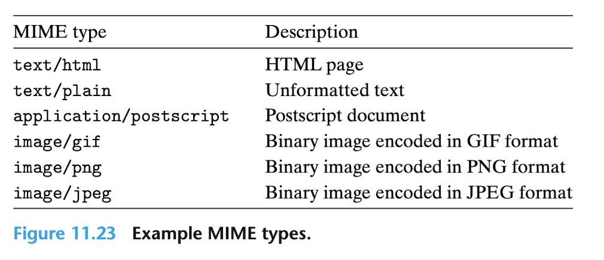
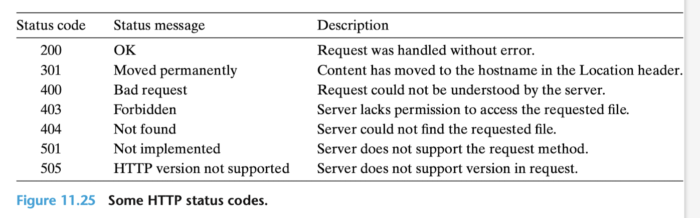
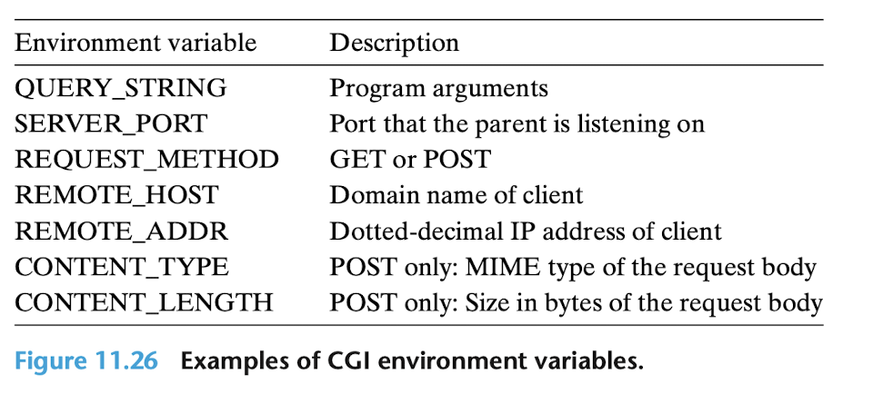

# 11. 5 웹 서버

지금가지 우리는 간단한 에코 서버의 맥락에서 네트워크 프로그래밍에 대해 논의했다. 이번 절에서는 우리는 당신만의 작고, 하지만 실용적인 웹 서버를 만들기 위한 네트워크 프로그래밍의 기본 아이디어를 사용하는 방법을 보여주겠다. 

### 11.5.1 웹 기초

웹 클라이언트와 서버는 텍스트 기반 응용 프로그램 레벨의 프로토콜인 HTTP (hypertext transfer protocol)을 기반으로 상호작용한다. HTTP는 간단한 프로토콜이다. 웹 클라이언트(브라우저라고 알려져 있다.)는 서버와의 인터넷 연결을 열고 연결을 닫는다. 브라우저는 콘텐츠를 읽고 그것을 화면에 전시한다.  

FTP와 같은 기존의 파일 검색 시스템 file retrieval services과 웹 서비스는 무엇이 다를까? 가장 주요한 차이점은 웹 콘텐츠가 HTML이라는 언어로 작성될 수 있다는 것이다. HTML 프로그램(페이지)는 브라우저에게 다양한 텍스트와 그래픽 객체들을 페이지에 어떻게 전시해야 할지를 알려주는  지시(태그)를 포함하고 있다.

예를 들어, 

```HTML
<b> Make me bold!</b>
```

이 코드는 브라우저에게 \<b\>와 <\/b\> 태그 사이에 있는 텍스트를 볼드체로 출력하라고 알려준다. 하지만 HTML의 진짜 강력함은 페이지가 다른 인터넷 호스트에 저장되어 있는 콘텐츠에 대한 포인터(하이퍼링크)를 포함할 수 있다는 것이다. 예를 들어, 다음과 같은 형식의 HTML 라인은 브라우저에게 텍스트를 하이라이팅하고, CMU 웹 서버에 저장되어 있는 `index.html`이라는 HTML 파일로 하이퍼링크를 생성하라고 말한다. 

```HTML
<a href="http://www.cmu.edu/index.html">Carnegie Mellon</a>
```

만약에 사용자가 하이라이팅된 텍스트 객체를 클릭한다면, 브라우저는 해당 HTML 파일을 CMU 서버에게 요청할 것이고 그것을 전시할 것이다.

> World Wide Web의 기원  
(생략)

### 11.5.2. 웹 콘텐츠

웹 클라이언트와 서버에게, 콘텐츠는 MIME 타입 (multipurpose internet mail extensions)와 연관된 바이트의 연속이다. 표 11.23은 몇 가지 흔한 MIME 타입을 보여준다.  



웹 서버는 두 가지 다른 방법으로 클라이언트들에게 콘텐츠를 제공한다.

- 디스크 파일을 가져와서 그것의 콘텐츠를 사용자에게 반환한다. 디스크 파일은 정적 콘텐츠라고 알려져 있고, 그것을 프로세스에게 반환하는 프로세스는 정적 콘텐츠를 서비스하는 것이라고 알려져 있다.
- 실행 가능한 파일을 실행하고 그것의 결과물을 클라이언트에게 반환한다. 런타임에 실행 가능한 파일로부터 산출된 결과물은 동적 콘텐츠라고 알려져 있다. 프로그램을 실행하고 그것의 결과물을 클라이언트에게 반환하는 프로세스는 동적 콘텐츠를 서비스하는 것이라고 알려져 있다.

웹 서버에 의해 반환된 모든 콘텐츠는 웹 서버가 관리하는 몇몇 파일들과 연관되어 있다. 이들 파일은 각각 URL (universal resource locator)라고 알려진 고유한 이름을 가지고 있다. 예를 들어, URL `http://www.google.com:80/index.html`은 `/index.html`이라고 불리는 `www.google.com`이라는 인터넷 호스트에 있는, 80번 포트에서 listening 중인 웹 서버에 의해 관리되는 HTML 파일을 식별한다. 실행 가능한 파일을 위한 URL들은 파일 이름 다음에 프로그램 인자를 포함한다. '?' 문자는 파일 이름과 각각의 인자를 분리하고, 각각의 인자는 '&' 문자에 의해 구분된다. 예를 들어, URL `http://bluefish.ics.cs.cmu.edu:8000/cgi-bin/adder?15000&213`은 `/cgi-bin/adder`이라는 실행 가능한 파일을 식별한다. 이는 두 개의 문자 인자와 함께 호출된다. 15000과 213이다. 클라이언트와 서버는 상호작용을 할 때 URL의 서로 다른 부분을 사용한다. 예를 들어, 클라이언트는 어떤 서버에 연결할지, 서버가 어디에 있는지, 어떤 포트가 listening 중인지를 확인하기 위해서 다음과 같은 URL의 앞부분을 사용한다. `http://www.google.com:80`  

서버는 파일 시스템에서 파일을 찾고, 요청이 정적 콘텐츠에 대한 것인지 동적 콘텐츠에 대한 것인지 확인하기 위해서 다음과 같은 뒷부분을 사용한다. `/index.html` 서버가 어떻게 URL의 뒷부분을 해석하는지를 이해하기 위해서는 몇 가지 살펴볼 점이 있다.

- URL이 정적 콘텐츠를 참조하는지 동적 콘텐츠를 참조하는지를 확인할 수 있는 표준 규칙은 없다. 각각의 서버는 자신이 관리하는 파일에 대해 자신만의 규칙을 가지고 있다. 고전적인 (구식의) 접근 방법은 `cgi-bin`과 같이 모든 동적 파일들이 위치하는 디렉토리들을 식별하는 것이다.
- 뒷부분의 시작 부분인 '/'는 리눅스의 루트 디렉토리를 나타내는 것이 아니다. 이것은 어떤 콘텐츠가 요청되었든지간에 그것의 홈 디렉토리를 나타낸다. 예를 들어, 서버는 모든 정적 콘텐츠들이 `/usr/httpd/html` 디렉토리에 저장되어 있고 모든 동적 콘텐츠들이 `/usr/httpd/cgi-bin`에 저장되어 있도록 구성되어야 한다.
- 가장 최소의 URL 뒷부분은 '/' 문자이다. ?? 모든 서버는 이를 `/index.html`과 같은 기본 홈페이지로 확장한다. 이는 브라우저에 도메인 이름을 타이핑하는 것만으로도 사이트의 홈페이지를 불러올 수 있는 이유를 설명해준다. 브라우저는 URL에 생략된 '/'를 덧붙인 후에 이를 서버에게 전달한다. 그러면 서버는 '/'를 다른 기본 파일 이름으로 확장한다.

### 11.5.3 HTTP 상호작용

HTTP가 인터넷 커넥션을 통해 전달되는 텍스트 라인에 기반을 두고 있기 때문에, 우리는 인터넷에 있는 모든 웹 서버와 상호작용을 수행하기 위해서 리눅스의 TELNET 프로그램을 사용한다. TELNET 프로그램은 원격 로그인 툴로서 SSH에 의해 크게 대체되었지만, 여전히 연결을 통해 텍스트 라인으로 클라이언트와 대화하는 서버를 디버깅하는 데 유용하다. 예를 들어, 코드 11.24는 AOL 웹 서버로부터 홈 페이지를 요청하기 위해 TELNET을 이용한다.  

라인 1에서, 우리는 리눅스 쉘로부터 TELNET을 실행시키고, AOL 웹 서버로의 연결을 열어달라고 요청한다. TELNET은 터미널에 세 줄을 출력하고, 연결을 열고, 우리가 텍스트를 입력하기를 기다린다. (라인 5) 우리가 텍스트 라인을 입력하고 엔터 키를 칠 때마다, TELNET은 라인을 읽고, carriage return과 line feed 문자(C 표기법으로 '\r\n')를 덧붙이고, 서버에게 라인을 전송한다. 이는 HTTP 표준과 일관성이 있다. 이는 모든 텍스트 라인이 carriage return 과 line feed의 쌍으로 종료되기를 요구한다. 상호 작용을 초기화하기 위해, 우리는 HTTP 요청에 진입한다. (라인 5-7) 서버는 HTTP 응답과 함께 응답하고 (라인 8-17) 연결을 닫는다. (라인 18)   

#### HTTP 요청

HTTP 요청은 요청 라인 (라인 5)으로 이루어져 있다. 이것 뒤에는 0 또는 더 많은 요청 헤더 (라인 6)이 뒤따르고, 헤더의 리스트를 종결하는 빈 텍스트 라인이 뒤따른다. 요청 라인은 다음과 같은 형식을 가지고 있다.

```
method URI version
```

HTTP는 GET, POST, OPTIONS, HEAD, PUT, DELETE, TRACE를 포함하는 다양한 방법을 지원한다. 우리는 자주 쓰이는 GET 메서드에 대해서만 논의할 것이다. 이는 대다수의 HTTP 요청을 처리한다. GET 메서드는 서버가 URI (uniform resource identifier)에 의해 확인된 콘텐트를 생성하고 반환하도록 지시한다. URI는 파일 이름과 옵션 인자를 포함하는 URL의 suffix이다. (이는 브라우저가 콘텐츠를 요청했을 때마 사실이다. 만약 프록시 서버가 콘텐츠를 요청했다면 URI는 완전한 URL이어야 한다.)

요청 라인에 있는 버전 필드는 요청이 따르고 있는 HTTP 버전을 나타낸다. 가장 최신의 HTTP 버전은 HTTP/1.1이다. HTTP/1.0은 1996년의 더 초기의, 더 간단한 버전이다. HTTP/1.1은 캐싱, 보안, 같은 지속적인 연결을 통해 클라이언트와 서버가 다양한 상호작용을 수행할 수 있도록 해주는 메커니즘 등의 향상된 기능에 대한 지원을 제공하는 추가적인 헤더를 정의한다. 실제로, 두 가지 버전은 호환이 가능하다. 왜냐하면 HTTP/1.0의 클라이언트와 서버는 알려지지 않은 HTTP/1.1 헤더를 가볍게 무시하기 때문이다.   

요약하자면, 라인 5에 있는 요청 라인은 서버에게 `/index.html` HTML 파일을 가져오고 이를 반환하도록 요청한다. 이 라인은 또한 서버에게 요청의 나머지 부분이 HTTP/1.1 형식 안에 있다고 알려준다.  

요청 헤더는 서버에게 브라우저의 브랜드 이름이나 브라우저가 이해할 수 있는 MIME 타입과 같은 추가적인 정보를 제공한다. 요청 헤더는 다음과 같은 형식을 가진다. 

```
header-name: header-data
```

논의를 위해서, 우리가 신경써야 할 헤더는 오직 Host 헤더이다. (라인 6) 이는 HTTP/1.1 요청에서 요구되는 것이고, HTTP/1.0 요청에서는 요구되지 않는 것이다. Host 헤더는 proxy caches에 의해 사용된다. proxy caches는 때때로 브라우저와 요청 파일을 관리하는 origin server 사이에서 중개자로서 역할한다. 여러 개의 프록시들은 소위 proxy chain 안에서 클라이언트와 origin server 사이에서 존재할 수 있다. Host 헤더에 있는 데이터들은, origin server의 도메인 이름을 식별하는, 요청받은 콘텐츠를 지역적으로 캐싱한 사본이 필요할지를 확인하기 위해 proxy chain의 중간에서 proxy를 허용한다. 


#### HTTP 응답

HTTP 응답은 HTTP 요청과 비슷하다. HTTP 응답은 응답 라인(라인 8)으로 이루어져 있고, 그 뒤에 0 또는 더 많은 응답 헤더가 뒤따른다. 그 뒤에는 response body (라인 15-17)이 뒤따른다. 응답 라인은 다음과 같은 형식을 가지고 있다.

```
version status-code status-message
```

`version` 필드는 응답이 따르는 HTTP 버전을 기술한다. `status-code`는 요청의 disposition을 가리키는 세 자리 양수 정수이다. `status-message`는 에러 코드에 대응되는 영어를 제공한다. 코드 11.25는 몇 가지 일반적인 상태 코드와 대응되는 메시지의 목록을 보여준다. 

> HTTP POST 요청에서 인자 전달하기  
HTTP POST 요청을 위한 인자는 URI가 아닌 request body를 통해 전달된다.




라인 9-13에 있는 응답 헤더는 응답에 대한 추가적인 정보를 제공한다. 우리의 논의를 위해서, 두 가지 가장 중요한 헤더는 Content-Type (라인 12)이다. 이는 클라이언트에게 response body에 있는 콘텐츠의 MIME 타입과 콘텐츠의 사이즈를 바이트로 가리키는 Content-Length (라인 13)을 알려준다.  

응답 헤더를 종료시키는 라인 14에 있는 빈 줄 뒤에는 response body가 뒤따른다. response body는 요청된 콘텐츠를 포함하고 있다.

### 11.5.4 동적 콘텐츠 서비스하기

만약 서버가 어떻게 클라이언트에게 동적 콘텐츠를 제공할지에 대해 고민을 멈춘다면, 한 가지 질문이 떠오른다. 예를 들어, 클라이언트는 어떻게 모든 프로그램 인자를 서버에게 전달할까? 서버는 어떻게 이 인자들을 자신이 생성한 자식 프로세스들에게 전달할까? 서버는 어덯게 자식이 콘텐츠를 생성할 때 필요할 수도 있는 다른 정보들을 자식에게 전달해줄 수 있을까? 자식은 자신의 결과물을 어디로 전송할까? 이러한 질문들은 사실상 표준인 CGI (common gateway interface)에 의해 다루어진다.

#### 클라이언트는 어떻게 프로그램 인자를 서버에게 전달하는가?

GET 요청을 위한 인자는 URI에 전달된다. '?' 문자는 파일 이름을 인자와 구분하고, 각각의 인자는 '&' 문자에 의해 구분된다. 인자에서 공백은 허용되지 않고, 공백은 반드시 %20으로 표현되어야 한다. 다른 특수 문자에 대해서도 비슷한 인코딩 방식이 있다.

#### 서버는 어떻게 인자를 자식에게 전달하는가?

서버가 다음과 같은 요청을 받고 나서

`GET /cgi-bin/addr?15000&213 HTTP/1.1`

서버는 자식 프로세스를 생성하기 위해 `fork`를 호출하고, `/cgi-bin/adder` 프로그램을 자식의 맥락에서 실행하기 위해 `execve`를 호출한다. adder과 같은 프로그램은 종종 CGI 프로그램이라고 불린다. 왜냐하면 이들은 CGI 표준의 규칙을 따르기 때문이다. execve를 호출하기 전에, 자식 프로세스는 CGI 환경 변수 QUERY_STRING을 15000&213으로 설정한다. 이는 adder 프로그램이 Linux의 getenv 함수를 이용하여 런타임에 참조할 수 있는 값이다.

#### 서버는 어떻게 자식으로 다른 정보를 전달하는가?

CGI는 CGI 프로그램이 설정되기를 기대하는 다양한 다른 환경 변수들을 정의한다. 표 11.26이 그 부분 집합을 보여준다. 



#### 자식은 자신의 결과물을 어디로 보내는가?

CGI 프로그램은 자신의 동적 콘텐츠를 표준 출력에 보낸다. 자식 프로세스가 로드하고 CGI 프로그램을 실행시키기 전에, 자식 프로세스는  리눅스 dup2 함수를 이용한다.